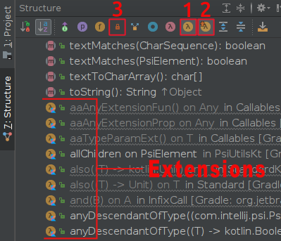

This plugin for IntelliJ and Android Studio adds Kotlin extension functions and extension properties which are defined
for a Kotlin or Java class to the [Structure View](https://www.jetbrains.com/help/idea/structure-tool-window-file-structure-popup.html) 
of that class.

Only top level `public` and `internal` extensions defined in the current project and top level `public` 
extensions defined in libraries are shown. When you enable _Show non-public_ [item `3` in the table below] `internal` extensions from libraries are shown too.

`Private` and local extensions are never shown (At least not as extensions, they still appear as normal definitions in the
Structure View of the file they are defined in, as do all extensions: this plugin does not remove any items from the Structure View).

<!-- To install: go to *Settings* -> *Plugins* -> *Browse repositories...* and search for "ExtSee". -->

|     |                                              |                      |
|-----|----------------------------------------------|----------------------|
| `1` |           | Show/hide extensions |
| `2` |  | Show/hide extensions defined on superclasses and interfaces |
| `3` |             | When enabled: show ``internal`` extensions defined inside libraries too |

